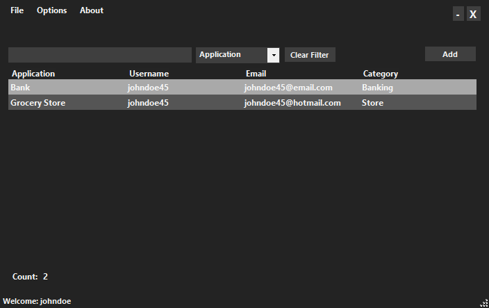

# Password Vault

Simple password manager using Argon2 and AES for password protection.



## Table of Contents

- [Password Vault](#password-vault)
  - [Table of Contents](#table-of-contents)
  - [About The Project](#about-the-project)
  - [Technology](#technology)
    - [Cipher Suite](#cipher-suite)
    - [Configuration](#configuration)
  - [Getting Started](#getting-started)
    - [Installation](#installation)
    - [Building](#building)
    - [Unit Tests](#unit-tests)

## About The Project

Wanting to learn more about security concepts, I decided to give a shot at my own password manager application built from scratch. The application defaults to parameters tuned for my desktop but may be modified for any application. Application is currently 100% offline, using SQLite to store passwords locally. WebAPI project is currently not complete and is reserved for possible future use.

## Technology

### Cipher Suite

The master password is hashed using Argon2Id using a 128 bit salt, producing a 256 bit hash. Argon parameters are tuned for ~5s execution time on a Ryzen 2700X. Upon logging in, a long 64 byte key is generated to be used for data encryption in place of the user's master password.

Sensitive data such as stored passwords are encrypted with AES256. Two 256 bit keys are generated with Argon2Id (~100ms execution on Ryzen 2700X) which serve as keys for the AES and HMAC algorithms. Encrypted data is then authenticated with HMAC256 to prevent data tampering.

### Configuration

Parameters for the application and algorithms used can be modified in a settings file. This file should be placed at `Documents/PasswordVault/PasswordVaultSettings.json`. The contents of the configuration should match below and can be modified accordingly. An example configuration is located at `PasswordVault.Data\TestDb\PasswordVaultSettings.json`.

**Supported key derivation algorithms:**

* Argon2Id: 0 (default)
* Pbkdf2: 1 (not recommended)

**Supported encryption algorithms:**

* Aes256CfbPkcs7: 0 (default)
* Aes128CfbPkcs7: 1
* Rijndael256CbcPkcs7: 2
* Rijndael128CbcPkcs7: 3

**Supported MAC algorithms:**

* HMACSHA256 (default)
* HMACSHA512

```json
{
  "MasterPasswordParameters": {
    "KeyDerivationParameters": {
      "Iterations": 4,
      "DegreeOfParallelism": 16,
      "MemorySizeKb": 1048576,
      "SaltSizeBytes": 16,
      "KeySizeBytes": 32,
      "Algorithm": 0
    },
    "RandomKeySize": 64
  },
  "EncryptionParameters": {
    "Algorithm": 1,
    "Mac": 1,
    "KeyDerivationParameters": {
      "Iterations": 1,
      "DegreeOfParallelism": 2,
      "MemorySizeKb": 1024,
      "SaltSizeBytes": 16,
      "KeySizeBytes": 32,
      "Algorithm": 0
    },
    "BlockSizeBytes": 16,
    "IvSizeBytes": 16
  },
  "TimeoutMinutes": 1
}
```

## Getting Started

### Installation

1. Clone repository with git:

```cmd
git clone https://github.com/willem445/PasswordVault.git
```

2. Open `PasswordVault.sln` with VS2019.

3. Right click on `Solution 'PasswordVault'` and select `Restore Nuget Packages`

### Building

Right click on `PasswordVault.Desktop.Winforms` and select `Rebuild`.

### Unit Tests

Run `GenerateUnitTestingMetrics.bat`
